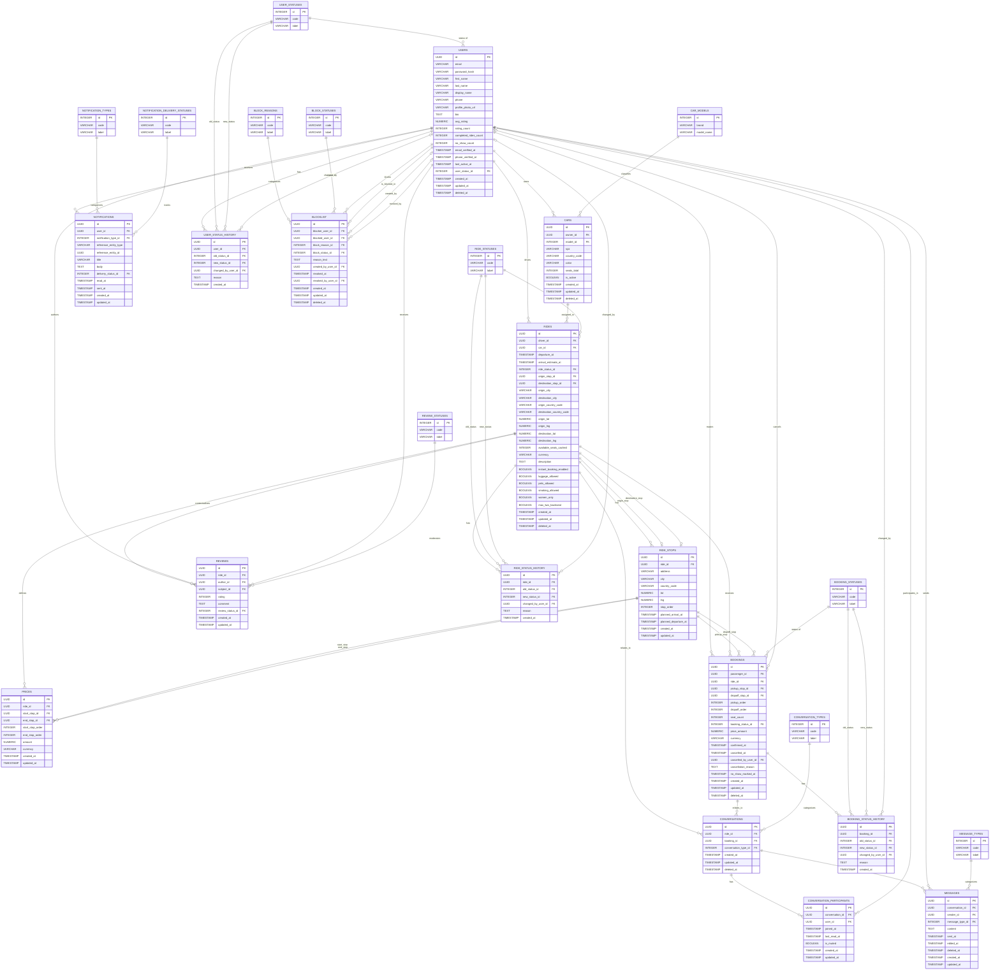

```mermaid
erDiagram
    USERS {
        UUID id PK
        VARCHAR email
        VARCHAR password_hash
        VARCHAR first_name
        VARCHAR last_name
        VARCHAR display_name
        VARCHAR phone
        VARCHAR profile_photo_url
        TEXT bio
        NUMERIC avg_rating
        INTEGER rating_count
        INTEGER completed_rides_count
        INTEGER no_show_count
        TIMESTAMP email_verified_at
        TIMESTAMP phone_verified_at
        TIMESTAMP last_active_at
        INTEGER user_status_id FK
        TIMESTAMP created_at
        TIMESTAMP updated_at
        TIMESTAMP deleted_at
    }

    CARS {
        UUID id PK
        UUID owner_id FK
        INTEGER model_id FK
        VARCHAR spz
        VARCHAR country_code
        VARCHAR color
        INTEGER seats_total
        BOOLEAN is_active
        TIMESTAMP created_at
        TIMESTAMP updated_at
        TIMESTAMP deleted_at
    }

    RIDES {
        UUID id PK
        UUID driver_id FK
        UUID car_id FK
        TIMESTAMP departure_at
        TIMESTAMP arrival_estimate_at
        INTEGER ride_status_id FK
        UUID origin_stop_id FK
        UUID destination_stop_id FK
        VARCHAR origin_city
        VARCHAR destination_city
        VARCHAR origin_country_code
        VARCHAR destination_country_code
        NUMERIC origin_lat
        NUMERIC origin_lng
        NUMERIC destination_lat
        NUMERIC destination_lng
        INTEGER available_seats_cached
        VARCHAR currency
        TEXT description
        BOOLEAN instant_booking_enabled
        BOOLEAN luggage_allowed
        BOOLEAN pets_allowed
        BOOLEAN smoking_allowed
        BOOLEAN women_only
        BOOLEAN max_two_backseat
        TIMESTAMP created_at
        TIMESTAMP updated_at
        TIMESTAMP deleted_at
    }

    RIDE_STOPS {
        UUID id PK
        UUID ride_id FK
        VARCHAR address
        VARCHAR city
        VARCHAR country_code
        NUMERIC lat
        NUMERIC lng
        INTEGER stop_order
        TIMESTAMP planned_arrival_at
        TIMESTAMP planned_departure_at
        TIMESTAMP created_at
        TIMESTAMP updated_at
    }

    PRICES {
        UUID id PK
        UUID ride_id FK
        UUID start_stop_id FK
        UUID end_stop_id FK
        INTEGER start_stop_order
        INTEGER end_stop_order
        NUMERIC amount
        VARCHAR currency
        TIMESTAMP created_at
        TIMESTAMP updated_at
    }

    BOOKINGS {
        UUID id PK
        UUID passenger_id FK
        UUID ride_id FK
        UUID pickup_stop_id FK
        UUID dropoff_stop_id FK
        INTEGER pickup_order
        INTEGER dropoff_order
        INTEGER seat_count
        INTEGER booking_status_id FK
        NUMERIC price_amount
        VARCHAR currency
        TIMESTAMP confirmed_at
        TIMESTAMP cancelled_at
        UUID cancelled_by_user_id FK
        TEXT cancellation_reason
        TIMESTAMP no_show_marked_at
        TIMESTAMP created_at
        TIMESTAMP updated_at
        TIMESTAMP deleted_at
    }

    REVIEWS {
        UUID id PK
        UUID ride_id FK
        UUID author_id FK
        UUID subject_id FK
        INTEGER rating
        TEXT comment
        INTEGER review_status_id FK
        TIMESTAMP created_at
        TIMESTAMP updated_at
    }

    CONVERSATIONS {
        UUID id PK
        UUID ride_id FK
        UUID booking_id FK
        INTEGER conversation_type_id FK
        TIMESTAMP created_at
        TIMESTAMP updated_at
        TIMESTAMP deleted_at
    }

    CONVERSATION_PARTICIPANTS {
        UUID id PK
        UUID conversation_id FK
        UUID user_id FK
        TIMESTAMP joined_at
        TIMESTAMP last_read_at
        BOOLEAN is_muted
        TIMESTAMP created_at
        TIMESTAMP updated_at
    }

    MESSAGES {
        UUID id PK
        UUID conversation_id FK
        UUID sender_id FK
        INTEGER message_type_id FK
        TEXT content
        TIMESTAMP sent_at
        TIMESTAMP edited_at
        TIMESTAMP deleted_at
        TIMESTAMP created_at
        TIMESTAMP updated_at
    }

    NOTIFICATIONS {
        UUID id PK
        UUID user_id FK
        INTEGER notification_type_id FK
        VARCHAR reference_entity_type
        UUID reference_entity_id
        VARCHAR title
        TEXT body
        INTEGER delivery_status_id FK
        TIMESTAMP read_at
        TIMESTAMP sent_at
        TIMESTAMP created_at
        TIMESTAMP updated_at
    }

    USER_STATUS_HISTORY {
        UUID id PK
        UUID user_id FK
        INTEGER old_status_id FK
        INTEGER new_status_id FK
        UUID changed_by_user_id FK
        TEXT reason
        TIMESTAMP created_at
    }

    RIDE_STATUS_HISTORY {
        UUID id PK
        UUID ride_id FK
        INTEGER old_status_id FK
        INTEGER new_status_id FK
        UUID changed_by_user_id FK
        TEXT reason
        TIMESTAMP created_at
    }

    BOOKING_STATUS_HISTORY {
        UUID id PK
        UUID booking_id FK
        INTEGER old_status_id FK
        INTEGER new_status_id FK
        UUID changed_by_user_id FK
        TEXT reason
        TIMESTAMP created_at
    }

    BLOCKLIST {
        UUID id PK
        UUID blocker_user_id FK
        UUID blocked_user_id FK
        INTEGER block_reason_id FK
        INTEGER block_status_id FK
        TEXT reason_text
        UUID created_by_user_id FK
        TIMESTAMP revoked_at
        UUID revoked_by_user_id FK
        TIMESTAMP created_at
        TIMESTAMP updated_at
        TIMESTAMP deleted_at
    }

    USER_STATUSES {
        INTEGER id PK
        VARCHAR code
        VARCHAR label
    }

    RIDE_STATUSES {
        INTEGER id PK
        VARCHAR code
        VARCHAR label
    }

    BOOKING_STATUSES {
        INTEGER id PK
        VARCHAR code
        VARCHAR label
    }

    REVIEW_STATUSES {
        INTEGER id PK
        VARCHAR code
        VARCHAR label
    }

    CONVERSATION_TYPES {
        INTEGER id PK
        VARCHAR code
        VARCHAR label
    }

    MESSAGE_TYPES {
        INTEGER id PK
        VARCHAR code
        VARCHAR label
    }

    NOTIFICATION_TYPES {
        INTEGER id PK
        VARCHAR code
        VARCHAR label
    }

    NOTIFICATION_DELIVERY_STATUSES {
        INTEGER id PK
        VARCHAR code
        VARCHAR label
    }

    CAR_MODELS {
        INTEGER id PK
        VARCHAR brand
        VARCHAR model_name
    }

    BLOCK_REASONS {
        INTEGER id PK
        VARCHAR code
        VARCHAR label
    }

    BLOCK_STATUSES {
        INTEGER id PK
        VARCHAR code
        VARCHAR label
    }

    USER_STATUSES ||--o{ USERS : "status of"
    USERS ||--o{ CARS : owns
    CAR_MODELS ||--o{ CARS : classifies

    USERS ||--o{ RIDES : drives
    CARS ||--o{ RIDES : assigned_to
    RIDE_STATUSES ||--o{ RIDES : "status of"

    RIDES ||--o{ RIDE_STOPS : has
    RIDE_STOPS o|--|| RIDES : origin_stop
    RIDE_STOPS o|--|| RIDES : destination_stop

    RIDES ||--o{ PRICES : defines
    RIDE_STOPS ||--o{ PRICES : start_stop
    RIDE_STOPS ||--o{ PRICES : end_stop

    USERS ||--o{ BOOKINGS : makes
    RIDES ||--o{ BOOKINGS : receives
    RIDE_STOPS ||--o{ BOOKINGS : pickup_stop
    RIDE_STOPS ||--o{ BOOKINGS : dropoff_stop
    BOOKING_STATUSES ||--o{ BOOKINGS : "status of"
    USERS o|--o{ BOOKINGS : cancels

    RIDES ||--o{ REVIEWS : contextualizes
    USERS ||--o{ REVIEWS : authors
    USERS ||--o{ REVIEWS : receives
    REVIEW_STATUSES ||--o{ REVIEWS : moderates

    RIDES ||--o{ CONVERSATIONS : relates_to
    BOOKINGS ||--o{ CONVERSATIONS : relates_to
    CONVERSATION_TYPES ||--o{ CONVERSATIONS : categorizes

    CONVERSATIONS ||--o{ CONVERSATION_PARTICIPANTS : has
    USERS ||--o{ CONVERSATION_PARTICIPANTS : participates_in

    CONVERSATIONS ||--o{ MESSAGES : contains
    USERS ||--o{ MESSAGES : sends
    MESSAGE_TYPES ||--o{ MESSAGES : categorizes

    USERS ||--o{ NOTIFICATIONS : receives
    NOTIFICATION_TYPES ||--o{ NOTIFICATIONS : categorizes
    NOTIFICATION_DELIVERY_STATUSES ||--o{ NOTIFICATIONS : tracks

    USERS ||--o{ USER_STATUS_HISTORY : has
    USER_STATUSES ||--o{ USER_STATUS_HISTORY : old_status
    USER_STATUSES ||--o{ USER_STATUS_HISTORY : new_status
    USERS o|--o{ USER_STATUS_HISTORY : changed_by

    RIDES ||--o{ RIDE_STATUS_HISTORY : has
    RIDE_STATUSES ||--o{ RIDE_STATUS_HISTORY : old_status
    RIDE_STATUSES ||--o{ RIDE_STATUS_HISTORY : new_status
    USERS o|--o{ RIDE_STATUS_HISTORY : changed_by

    BOOKINGS ||--o{ BOOKING_STATUS_HISTORY : has
    BOOKING_STATUSES ||--o{ BOOKING_STATUS_HISTORY : old_status
    BOOKING_STATUSES ||--o{ BOOKING_STATUS_HISTORY : new_status
    USERS o|--o{ BOOKING_STATUS_HISTORY : changed_by

    BLOCK_REASONS ||--o{ BLOCKLIST : categorizes
    BLOCK_STATUSES ||--o{ BLOCKLIST : "status of"
    USERS ||--o{ BLOCKLIST : blocks
    USERS ||--o{ BLOCKLIST : is_blocked_in
    USERS o|--o{ BLOCKLIST : created_by
    USERS o|--o{ BLOCKLIST : revoked_by
```
